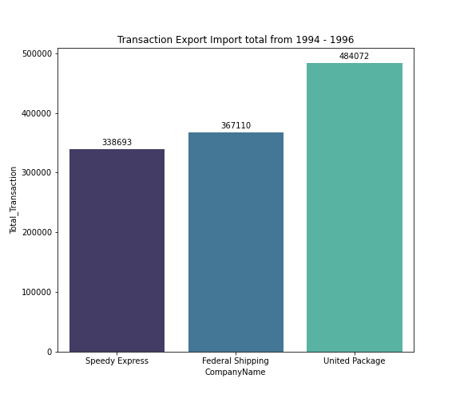
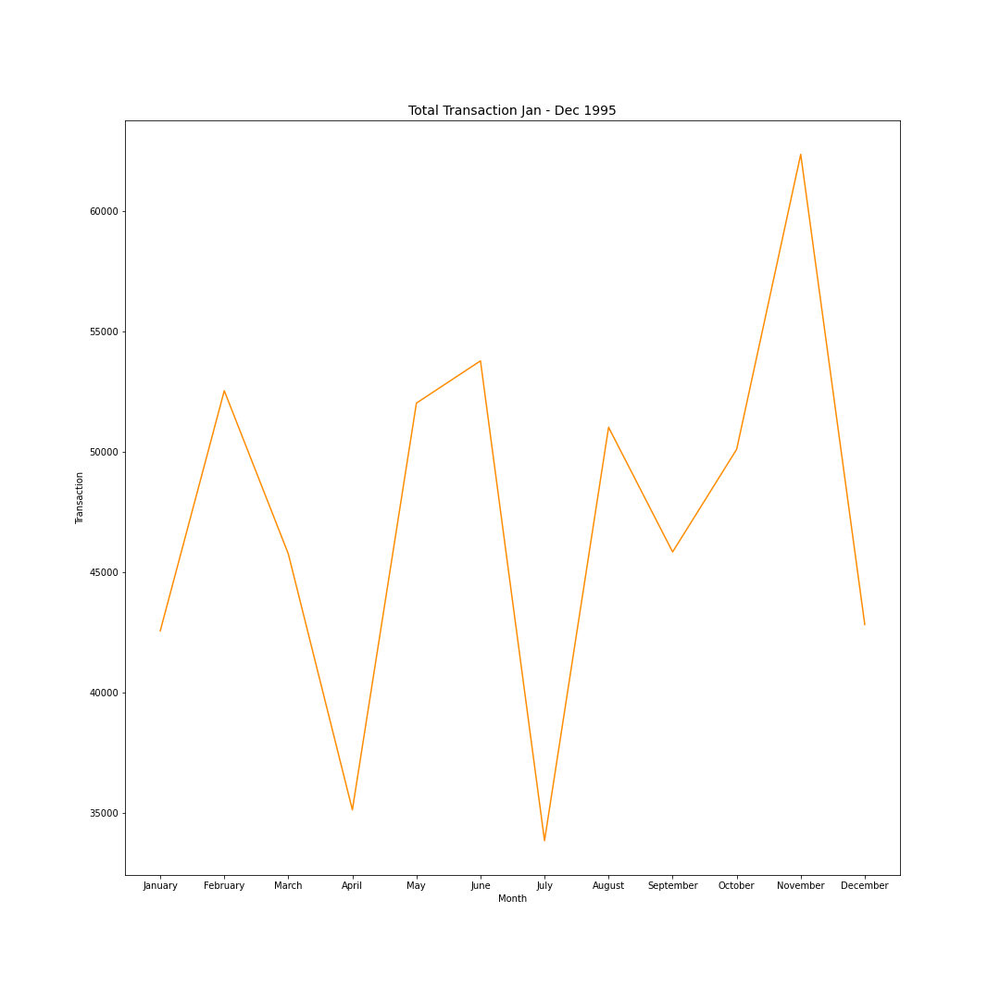
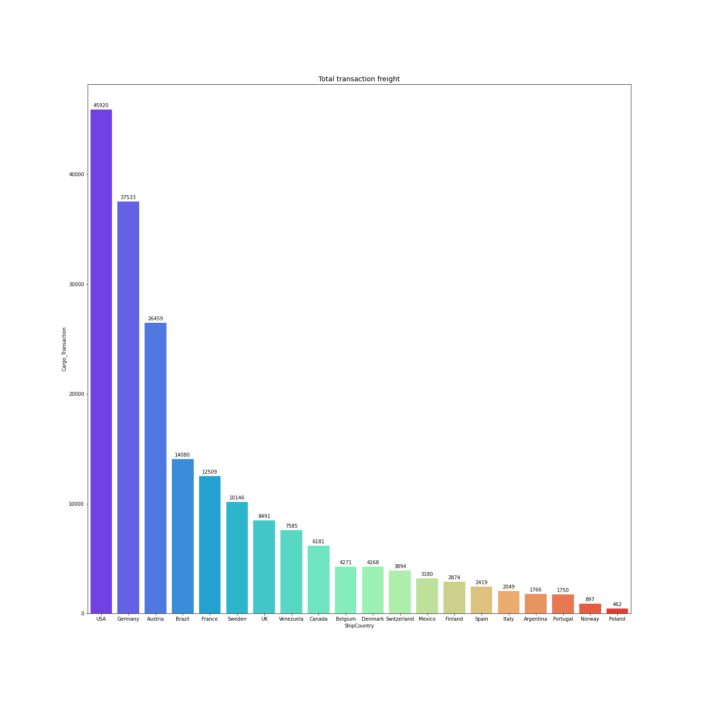

# Exploratory Data Analysis Orders analytics in Northwind 

# Business Problem 

## Transaksi perdagangan saat ini tidak stabil

# Business Goal

## Mengetahui perkembangan transaksi pemesanan

# Business Question 

## 1. Jumlah transaksi barang keseluruhan ketiga perusahaan dari 1994 - 1996 

</img>

<ul> United Package memiliki transaksi tertinggi eksport import dengan mencapai USD 484072 </ul>

## 2. Perkembangan Total transaksi barang bulan januari - desember ditahun 1995 

</img>

<ul> Transaksi tertinggi terjadi dibulan november dan terendah dibulan juli </ul>

## 3. Negara yang memiliki jumlah total transaksi kargo  

</img>

<ul> USA merupakan negara yang memiliki transaksi kargo tertinggi </ul>

# Insight

## - USA merupakan negara yang dimana tingkat perdagangan tertinggi dibandingkan dengan negara lain

# Rekomendasi 

## - Perlunya ditingkatkan transaksi ekspor import dengan dipermudah proses pengiriman barang dengan cara regulasi yang efisien dan waktu pengiriman secara instan
